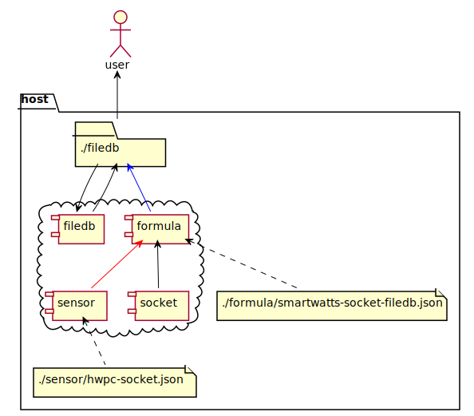
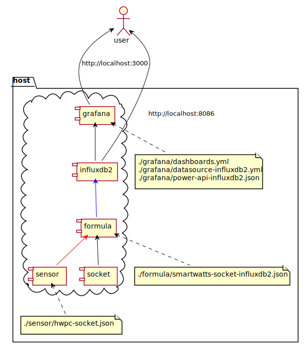
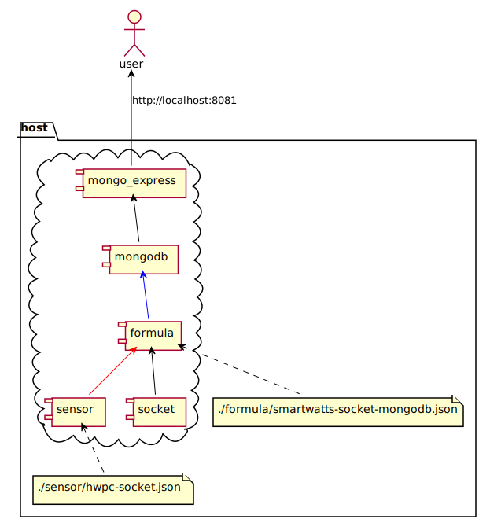
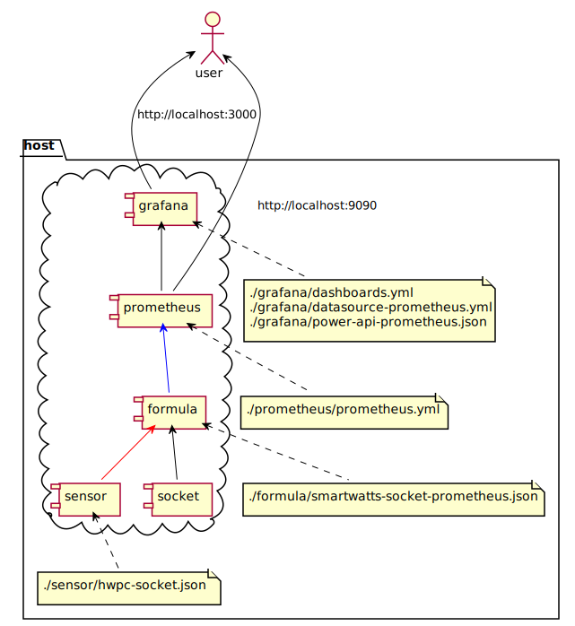
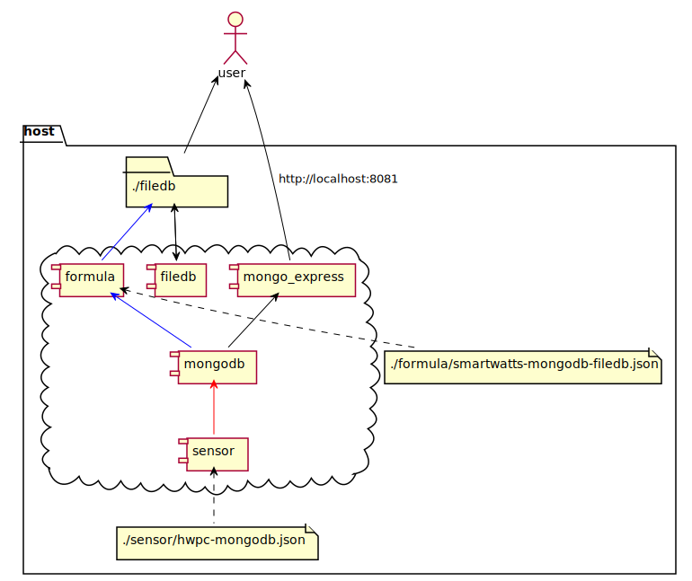
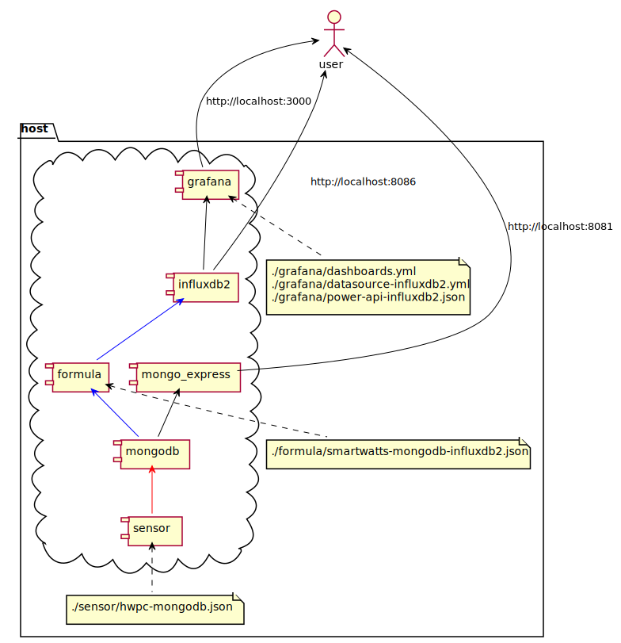
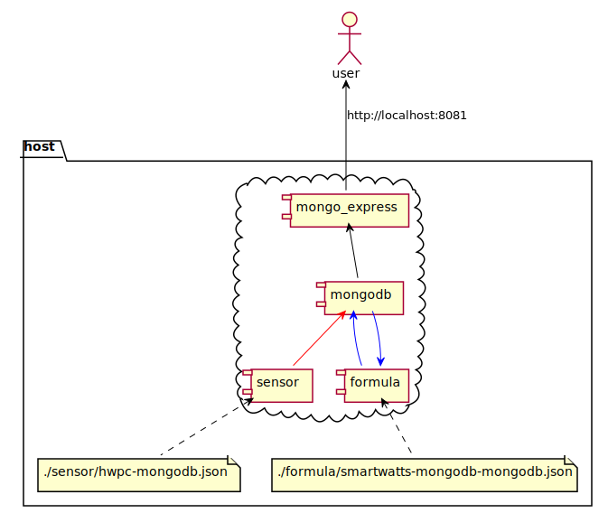
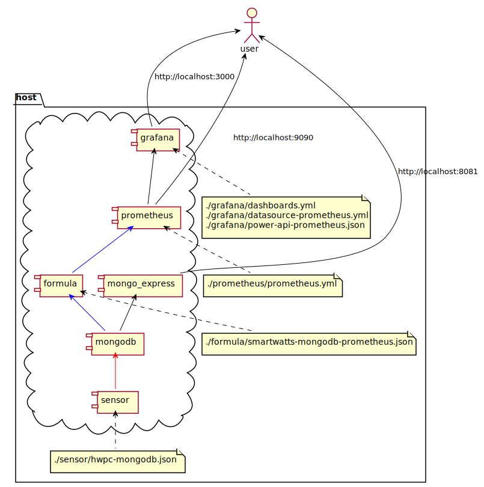

# PowerAPI Docker Toolchain

This folder contains several resources to test and configure PowerAPI on Docker based hosting platform using docker-compose.


**NOTE:** 
* This toolchain is meant for running quick tests 
  of the PowerAPI energy metering solution
  and is not suitable for detailed analysis.
* For simplicity sake all components are deployed on a single host. 
  While it makes it much easier to quickly experiment with PowerAPI monitoring,
  it should not be used when running actual tests. You should only run the sensor
  on your target systems and all other components on an independent system
  used only for monitoring.
* This toolchain eventually can be used to test, select and build your own deployment
  based on current settings and diagrams available in this folder.

## Prerequisites

* a linux system (tested on ubuntu 20.04 and 22.04)
* docker
* docker-compose
* internet access for docker registry

## Quick Start

No build step is needed, the default settings based on [mongodb/prometheus](#mongodb_prometheus) configuration can be launched "Out  of the box" with command below:

```
docker-compose up
```

Always stop properly components to unmount associated resources:

```
docker-compose down
```

For more accurate measurements, you should configure the formula according to the cpu on you host. This can be done by configuring CPU profile in _./formula_ folder configuration files.
Look at [the offical powerapi documentation](https://powerapi-ng.github.io/howto_monitor_process/deploy_formula.html) to see which value to use for `cpu-ratio-base`,`cpu-ratio-min` and `cpu-ratio-max`.

## Configuration

Based on docker-compose **profiles** and **.env** file, several configurations are available based on [Sources/Destinations](https://powerapi.org/reference/database/sources_destinations/) matrix:

| Source  | Destination |                             |
|---------|-------------|-----------------------------|
| socket  | csv         | [view](#socket_csv)         |
| socket  | filedb      | [view](#socket_filedb)      |
| socket  | influxdb2   | [view](#socket_influxdb2)   |
| socket  | mongodb     | [view](#socket_mongodb)     |
| socket  | prometheus  | [view](#socket_prometheus)  |
| mongodb | csv         | [view](#mongodb_csv)        |
| mongodb | filedb      | [view](#mongodb_filedb)     |
| mongodb | influxdb2   | [view](#mongodb_influxdb2)  |
| mongodb | mongodb     | [view](#mongodb_mongodb)    |
| mongodb | prometheus  | [view](#mongodb_prometheus) |

Source and Destination selection can be done editing **.env** file as follow:
```properties
# Source selection
# Available options: mongodb, socket
POWERAPI_SOURCE=mongodb

# Destination selection
# Available options: influxdb2, prometheus, mongodb, csv, filedb
POWERAPI_DESTINATION=prometheus
```

Currently, only [HWPC Sensor](https://powerapi.org/reference/sensors/hwpc-sensor/) and [SmartWatts Formula](https://powerapi.org/reference/formulas/smartwatts/) are supported and can be modified with properties below:
```properties
# Sensor selection
# Available options: hwpc
SENSOR_TYPE=hwpc
SENSOR_IMAGE=powerapi/${SENSOR_TYPE}-sensor:1.3.0

# Formula selection
# Available options: smartwatts
FORMULA_TYPE=smartwatts
FORMULA_IMAGE=powerapi/${FORMULA_TYPE}-formula:2.2.0
```

At last, it's also possible to use specific images for third party components:
```properties
# Third party images
MONGO_IMAGE=mongo:7.0.8
MONGOEXPRESS_IMAGE=mongo-express:1.0.2-20
INFLUXDB_IMAGE=influxdb:2.7.5
GRAFANA_IMAGE=grafana/grafana:10.1.9
PROMETHEUS_IMAGE=prom/prometheus:v2.51.2
CSV_IMAGE=busybox:stable-glibc
FILEDB_IMAGE=busybox:stable-glibc
SOCKET_IMAGE=busybox:stable-glibc
```

**NOTE:** 
* .env mechanism is native to docker-compose, this way, environnement is loaded by docker-compose
  without manual operations,
* profiles mechanism allows to deploy only required components without editing docker-compose.yml,
* each configuration is detailed below for further information on usage and settings.

#### <a name="socket_csv"></a> Source: Socket - Destination: CSV

<!--
@startuml plantuml/socket_csv
actor user
package host {
cloud {
    component sensor
    component formula
    component csv
    component socket
  }
  folder "./csv" as csv_folder
  file "./sensor/hwpc-socket.json" as sensor_conf
  file "./formula/smartwatts-socket-csv.json" as formula_conf
}
sensor <-[#black,dashed]- sensor_conf
formula <-[#black,dashed]- formula_conf

formula <-[#red]- sensor
formula <-[#black]- socket

csv_folder <-[#blue]- formula

csv_folder <-[#black]- csv
csv <-[#black]- csv_folder

user <-[#black]- csv_folder
@enduml
-->


An additional service **socket** is created and started to allow custom treatments on sockets, it can be edited using specific image **SOCKET_IMAGE** (default set to busybox) and using custom command attribute.

An additional service **csv** is created and started to allow custom treatments on ./csv folder and files, it can be edited using specific image **CSV_IMAGE** (default set to busybox) and using custom command attribute.

#### <a name="socket_filedb"></a> Source: Socket - Destination: FileDB

<!--
@startuml plantuml/socket_filedb
actor user
package host {
cloud {
    component sensor
    component formula
    component filedb
    component socket
  }
  folder "./filedb" as filedb_folder
  file "./sensor/hwpc-socket.json" as sensor_conf
  file "./formula/smartwatts-socket-filedb.json" as formula_conf
}
sensor <-[#black,dashed]- sensor_conf
formula <-[#black,dashed]- formula_conf

formula <-[#red]- sensor
formula <-[#black]- socket

filedb_folder <-[#blue]- formula

filedb_folder <-[#black]- filedb
filedb<-[#black]- filedb_folder

user <-[#black]- filedb_folder
@enduml
-->



An additional service **socket** is created and started to allow custom treatments on sockets, it can be edited using specific image **SOCKET_IMAGE** (default set to busybox) and using custom command attribute.

An additional service **filedb** is created and started to allow custom treatments on ./filedb folder and files, it can be edited using specific image **FILEDB_IMAGE** (default set to busybox) and using custom command attribute.

#### <a name="socket_influxdb2"></a> Source: Socket - Destination: InfluxDB2

<!--
@startuml plantuml/socket_influxdb2
actor user
actor user
package host {
cloud {
    component sensor
    component formula
    component socket
    component influxdb2
    component grafana
  }
  file "./sensor/hwpc-socket.json" as sensor_conf
  file "./formula/smartwatts-socket-influxdb2.json" as formula_conf
  file "./grafana/dashboards.yml\n./grafana/datasource-influxdb2.yml\n./grafana/power-api-influxdb2.json" as grafana_conf
}
sensor <-[#black,dashed]- sensor_conf
formula <-[#black,dashed]- formula_conf
grafana <-[#black,dashed]- grafana_conf

formula <-[#red]- sensor
formula <-[#black]- socket

influxdb2 <-[#blue]- formula

grafana <-[#black]- influxdb2 

user <-[#black]- grafana : http://localhost:3000
user <-[#black]- influxdb2 : http://localhost:8086
@enduml
-->


  
Report can be viewed in Grafana dashboard with two panels:
* the top panel  represents the energy consumption fo each constainer running on your host.
* the bottom panel represents the energy consumption for the whole CPU as reported directly by the CPU (in green) and as estimated by powerAPI (in yellow).

An additional service **socket** is created and started to allow custom treatments on sockets, it can be edited using specific image **SOCKET_IMAGE** (default set to busybox) and using custom command attribute.

#### <a name="socket_mongodb"></a> Source: Socket - Destination: MongoDB

<!--
@startuml plantuml/socket_mongodb
actor user
package host {
cloud {
    component sensor
    component formula
    component socket
    component mongodb
    component mongo_express
  }
  file "./sensor/hwpc-socket.json" as sensor_conf
  file "./formula/smartwatts-socket-mongodb.json" as formula_conf
}
sensor <-[#black,dashed]- sensor_conf
formula <-[#black,dashed]- formula_conf

formula <-[#red]- sensor
formula <-[#black]- socket

mongodb <-[#blue]- formula 

mongo_express <-[#black]- mongodb

user <-[#black]- mongo_express : http://localhost:8081
@enduml
-->



Mongo Express is used as GUI, MongoDB datasource for Grafana is part of Enterprise Edition only.

An additional service **socket** is created and started to allow custom treatments on sockets, it can be edited using specific image **SOCKET_IMAGE** (default set to busybox) and using custom command attribute.

#### <a name="socket_prometheus"></a> Source: Socket - Destination: Prometheus

<!--
@startuml plantuml/socket_prometheus
actor user 
package host {
cloud {
    component sensor
    component formula
    component socket
    component prometheus
    component grafana
  }
  file "./sensor/hwpc-socket.json" as sensor_conf
  file "./formula/smartwatts-socket-prometheus.json" as formula_conf
  file "./prometheus/prometheus.yml" as prometheus_conf
  file "./grafana/dashboards.yml\n./grafana/datasource-prometheus.yml\n./grafana/power-api-prometheus.json" as grafana_conf
}
sensor <-[#black,dashed]- sensor_conf
formula <-[#black,dashed]- formula_conf
grafana <-[#black,dashed]- grafana_conf
prometheus <-[#black,dashed]- prometheus_conf

formula <-[#red]- sensor
formula <-[#black]- socket

prometheus <-[#blue]- formula

grafana <-[#black]- prometheus

user <-[#black]- grafana : http://localhost:3000
user <-[#black]- prometheus : http://localhost:9090
@enduml
-->



Formula acts as Prometheus exporter in this configuration, Prometheus component is polling formula to retrieve data.

Report can be viewed in Grafana dashboard with two panels:
* the top panel  represents the energy consumption fo each constainer running on your host.
* the bottom panel represents the energy consumption for the whole CPU as reported directly by the CPU (in green) and as estimated by powerAPI (in yellow).

An additional service **socket** is created and started to allow custom treatments on sockets, it can be edited using specific image **SOCKET_IMAGE** (default set to busybox) and using custom command attribute.

#### <a name="mongodb_csv"></a> Source: MongoDB - Destination: CSV

<!--
@startuml plantuml/mongodb_csv
actor user
package host {
cloud {
    component sensor
    component formula
    component csv
    component mongodb
    component mongo_express
  }
  folder "./csv" as csv_folder
  file "./sensor/hwpc-mongodb.json" as sensor_conf
  file "./formula/smartwatts-mongodb-csv.json" as formula_conf
}
sensor <-[#black,dashed]- sensor_conf
formula <-[#black,dashed]- formula_conf

mongodb <-[#red]- sensor

formula <-[#blue]- mongodb
csv_folder <-[#blue]- formula

csv_folder <-[#black]- csv
csv <-[#black]- csv_folder

mongo_express <-[#black]- mongodb

user <-[#black]- csv_folder
user <-[#black]- mongo_express : http://localhost:8081
@enduml
-->


An additional service **csv** is created and started to allow custom treatments on ./csv folder and files, it can be edited using specific image **CSV_IMAGE** (default set to busybox) and using custom command attribute.

#### <a name="mongodb_filedb"></a> Source: MongoDB - Destination: FileDB

<!--
@startuml plantuml/mongodb_filedb
actor user
package host {
cloud {
    component sensor
    component formula
    component filedb
    component mongodb
    component mongo_express
  }
  folder "./filedb" as filedb_folder
  file "./sensor/hwpc-mongodb.json" as sensor_conf
  file "./formula/smartwatts-mongodb-filedb.json" as formula_conf
}
sensor <-[#black,dashed]- sensor_conf
formula <-[#black,dashed]- formula_conf

mongodb <-[#red]- sensor

formula <-[#blue]- mongodb
filedb_folder <-[#blue]- formula

filedb_folder <-[#black]- filedb
filedb<-[#black]- filedb_folder

mongo_express <-[#black]- mongodb

user <-[#black]- filedb_folder
user <-[#black]- mongo_express : http://localhost:8081
@enduml
-->



An additional service **filedb** is created and started to allow custom treatments on ./filedb folder and files, it can be edited using specific image **FILEDB_IMAGE** (default set to busybox) and using custom command attribute.

#### <a name="mongodb_influxdb2"></a> Source: MongoDB - Destination: InfluxDB2

<!--
@startuml plantuml/mongodb_influxdb2
actor user
package host {
cloud {
    component sensor
    component formula
    component mongodb
    component mongo_express
    component influxdb2
    component grafana
  }
  file "./sensor/hwpc-mongodb.json" as sensor_conf
  file "./formula/smartwatts-mongodb-influxdb2.json" as formula_conf
  file "./grafana/dashboards.yml\n./grafana/datasource-influxdb2.yml\n./grafana/power-api-influxdb2.json" as grafana_conf
}
sensor <-[#black,dashed]- sensor_conf
formula <-[#black,dashed]- formula_conf
grafana <-[#black,dashed]- grafana_conf

mongodb <-[#red]- sensor

formula <-[#blue]- mongodb
influxdb2 <-[#blue]- formula

grafana <-[#black]- influxdb2

mongo_express <-[#black]- mongodb

user <-[#black]- mongo_express : http://localhost:8081
user <-[#black]- grafana : http://localhost:3000
user <-[#black]- influxdb2 : http://localhost:8086
@enduml
-->


  
Report can be viewed in Grafana dashboard with two panels:
* the top panel  represents the energy consumption fo each constainer running on your host.
* the bottom panel represents the energy consumption for the whole CPU as reported directly by the CPU (in green) and as estimated by powerAPI (in yellow).
  
#### <a name="mongodb_mongodb"></a> Source: MongoDB - Destination: MongoDB

<!--
@startuml plantuml/mongodb_mongodb
actor user
package host {
cloud {
    component sensor
    component formula
    component mongodb
    component mongo_express
  }
  file "./sensor/hwpc-mongodb.json" as sensor_conf
  file "./formula/smartwatts-mongodb-mongodb.json" as formula_conf
}
sensor <-[#black,dashed]- sensor_conf
formula <-[#black,dashed]- formula_conf

mongodb <-[#red]- sensor

formula <-[#blue]- mongodb
mongodb <-[#blue]- formula 

mongo_express <-[#black]- mongodb

user <-[#black]- mongo_express : http://localhost:8081
@enduml
-->



Mongo Express is used as GUI, MongoDB datasource for Grafana is part of Enterprise Edition only.

#### <a name="mongodb_prometheus"></a> Source: MongoDB - Destination: Prometheus

<!--
@startuml plantuml/mongodb_prometheus
actor user 
package host {
cloud {
    component sensor
    component formula
    component mongodb
    component mongo_express
    component prometheus
    component grafana
  }
  file "./sensor/hwpc-mongodb.json" as sensor_conf
  file "./formula/smartwatts-mongodb-prometheus.json" as formula_conf
  file "./prometheus/prometheus.yml" as prometheus_conf
  file "./grafana/dashboards.yml\n./grafana/datasource-prometheus.yml\n./grafana/power-api-prometheus.json" as grafana_conf
}
sensor <-[#black,dashed]- sensor_conf
formula <-[#black,dashed]- formula_conf
grafana <-[#black,dashed]- grafana_conf
prometheus <-[#black,dashed]- prometheus_conf

mongodb <-[#red]- sensor

formula <-[#blue]- mongodb
prometheus <-[#blue]- formula

grafana <-[#black]- prometheus

mongo_express <-[#black]- mongodb

user <-[#black]- mongo_express : http://localhost:8081
user <-[#black]- grafana : http://localhost:3000
user <-[#black]- prometheus : http://localhost:9090
@enduml
-->



Formula acts as Prometheus exporter in this configuration, Prometheus component is polling formula to retrieve data.

Report can be viewed in Grafana dashboard with two panels:
* the top panel  represents the energy consumption fo each constainer running on your host.
* the bottom panel represents the energy consumption for the whole CPU as reported directly by the CPU (in green) and as estimated by powerAPI (in yellow).