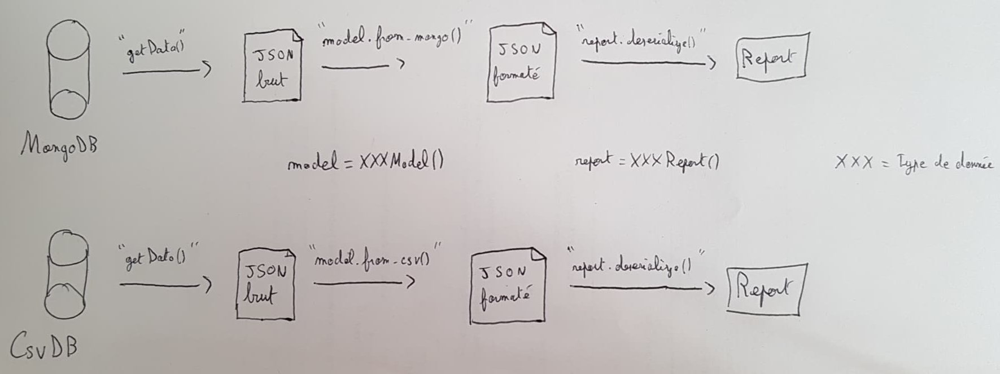

.. Concept page

Concepts
##############

Message
*******

Les échanges entre les différents acteurs sont effectués par l’envoie de message par leur sockets, et sont divisibles en deux catégories distinctes, les messages de données et les messages de contrôle.

Un message de donnée est en fait un ``Report`` sérialisé à l’aide de la bibliotèque ``pickle``. Ce message est toujours un objet héritant de la classe abstraite ``Report``.
Un message de contrôle permet de demander à un acteur d’effectuer une action, qui peuvent dépendre du contexte et du moment ou il reçoit ce message. On peut trouver les messages suivants :

* ``PoisonPillMessage`` : Demande à un acteur de s’arrêter.
* ``StartMessage`` : Demande à un acteur de procéder à son initialisation.
* ``OkMessage`` : Après l’envoie d’un ``StartMessage``, le processus étant en charge de l’initialisation doit attendre une réponse, ``OKMessage`` est la réponse dans le cas ou l’initialisation s’est bien passé.
* ``ErrorMessage`` : Après l’envoie d’un ``StartMessage``, le processus étant en charge de l’initialisation doit attendre une réponse, ``ErrorMessage`` est la réponse dans le cas ou l’initialisation a échoué.

Database
********

Une base de donnée permet de stocker des données dans un format et avec des spécificités différentes. 
A ce jour, il est possible d’utiliser les types de base de donnée suivantes :

* MongoDB
* Csv

Les bases de données implémenté dans SmartWatts héritent toutes de la classe ``BaseDB`` qui permet de définir une liste de méthode utilisable de façon transparente indépendamment du type de base.

Report
******

Report
======

Un ``Report`` correspond à une donnée récupérée dans une base de donnée. La classe permet de simplifier la sérialisation / désérialisation de la donnée. Pour être plus précis, lorsque l’on récupère une donnée dans la BDD, celle-ci nous est retourné brute et pas forcément formaté de la manière dont on le souhaiterait, la plupart du temps sous un format JSON (qui est un format basique en python). La classe ``ReportModel`` va redéfinir le format de la donnée pour qu’elle soit désérialisable pour la classe ``Report``

ReportModel
===========

Le ``ReportModel`` est une classe qui définit la façon de formater les données selon le type de base de donnée lue. Il est nécessaire de définir un XXXModel, pour chaque XXXReport, et de redéfinir une méthode pour chaque type de base de donnée que l’on souhaite utiliser.

Schéma explicatif :

BDD => Json XXX brut => XXXModel => Json XXX format => XXXReport
