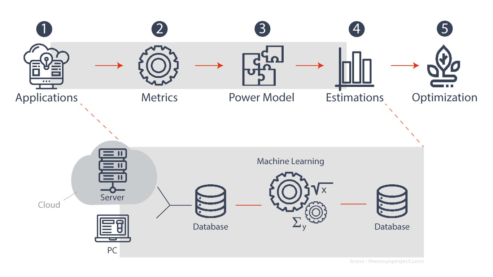
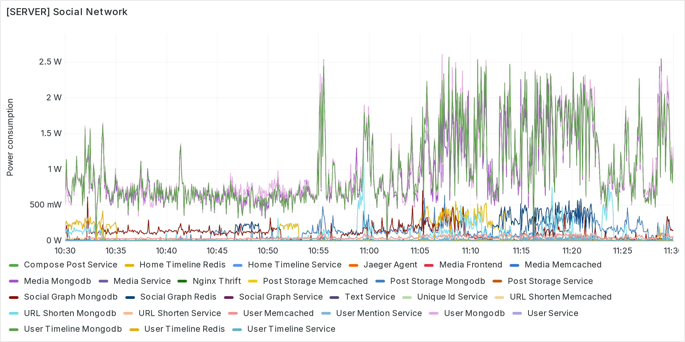
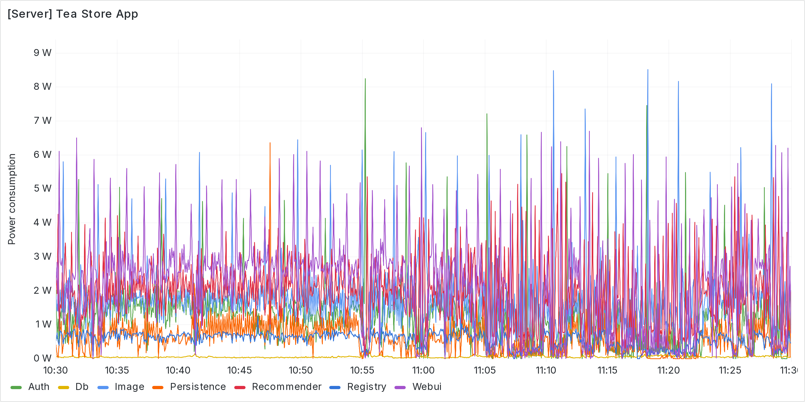
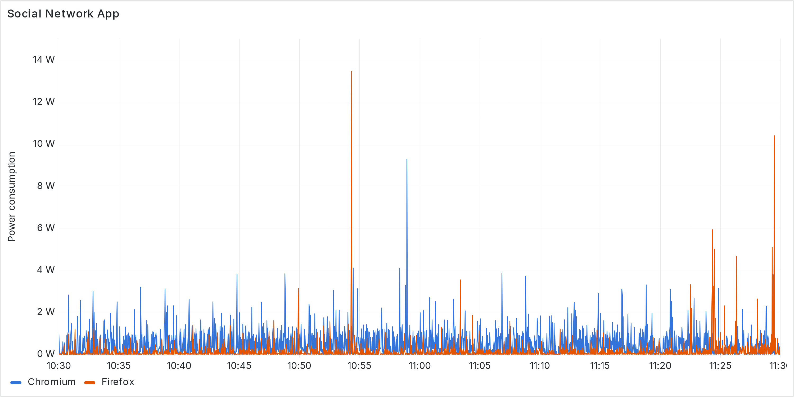
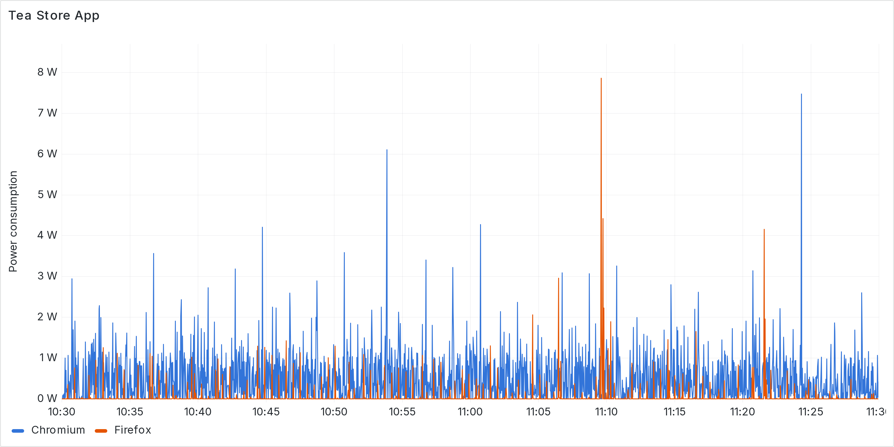

# Summary

Software that we use daily for accessing digital services from connected devices has a negative impact on the environment as it consumes energy. These digital services, hosted by physical machines around the world, also contribute to planetary pollution. Unfortunately, providers of these online services mostly focus on hardware efficiency to reduce the environmental impact without considering the software they host. For this reason, we propose [`PowerAPI`](https://powerapi.org/) [@powerapi-core], a software-defined solution that delivers real-time estimations of software power consumption to spot opportunities to reduce it and therefore to limit their impact on the planet beyond hardware improvements.

# Statement of need

State-of-the-art power meters only measure the global consumption of power of the machines hosting the software. To deal with this limitation, several software-defined power meters have been proposed. However, they are statically designed and coupled to a specific processor family or they are mainly based on power models that need a lot of data and time to be trained to predict power consumption accurately [@colmant:2018; @lebeane:2015]. Power models designed in this way are only suitable for environmental conditions (i.e., memory usage, CPU usage, kinds of running applications) similar to those when the data for the training was collected. If these conditions change, power models become deprecated and have to be trained again, which make them unsuitable for production environments of Cloud providers.

To deal with this constraint, we developed [`PowerAPI`](https://powerapi.org/) [@powerapi-core], a software toolkit for assembling software power meters, enabling developers/IT administrators to monitor power consumption of software that they write/deploy. Software-defined power meters created with `PowerAPI` enable power consumption estimations at different granularity levels: process, thread, container, virtual machine, etc. Furthermore, power models used by `PowerAPI` are continuously self-calibrated to consider current execution conditions of the machine hosting the software.  

\autoref{fig:powerapi-overview} present the general idea behind a Software Power Meter in `PowerAPI`:

1. A Sensor collects raw metrics related to a machine hosting applications/software to be monitored in terms of energy consumption.
2. These metrics are stored in a database to be consumed by a software power model.
3. This power model uses machine learning techniques to estimate energy consumption of applications/software with the raw metrics and it calibrates itself when required.
4. Estimations produced by the power model are stored in another database.
5. The stored estimations are used to optimize concerned applications/software.      

{ width=80%}

Currently, `PowerAPI` offers a software-defined power meter composed by `Hardware Performance Counter` (`HwPC`) Sensor [@hwpc-sensor] and `SmartWatts` Formula [@fieni:2020; @smartwatts]. `HwPC` Sensor is written in `C` and is based on the _Running Average Power Limit_ (RAPL) interface [@intel:2023], available on Intel and AMD processors,  and the `perf` tool and `cgroup` from the Linux kernel. `SmartWatts` Formula, developed in Python, defines a power model based on a linear regression from the [sckit-learn](https://scikit-learn.org/stable/) library [@pedregosa:2011], which is self-calibrated by using suitable performance counters and an error threshold provided by the Power Meter user. It is possible to use a `CSV` files, `MongoDB`, or a `HTTP` Socket to store metrics from Sensors. For storing estimations, `PowerAPI` offers `CSV` files, `MongoDB`, `InfluxDB`, and `Prometheus`.

`PowerAPI` is based on the actor model [@hewitt:1973; @agha:1986], which means that there is a low coupling between different architectural elements in a software-defined power meter. This fosters the creation of new `Formulas` and/or `Sensors` actors to tune software-defined power meters according to requirements.

# Tool Demonstration

A demonstrator of `PowerAPI` is made available to illustrate the deployment of a software-defined power meter on a Xeon CPU E5-2407 Intel processor (Sandy Bridge Family) running Debian 11. The selected configuration includes `MongoDB` for storing metrics and `InfluxDB` for the estimations.
In this demonstration, we monitor, in real-time, the power consumption of two web applications based on a microservice architecture and hosted by a bare-metal server: a social network from [DeathStarBench](https://github.com/delimitrou/DeathStarBench) and [tea store online](https://github.com/DescartesResearch/TeaStore) developed by the [Descartes Research group](https://se.informatik.uni-wuerzburg.de/). \autoref{fig:server-consumption-sn} and \autoref{fig:server-consumption-ts} depicts the [grafana](https://grafana.com/) dashboard for these web applications.

{width=80%}

{width=80%}

In the tool demonstration, we also monitor, in real-time, a client laptop accessing the above-mentioned web applications from Firefox and Chromium. The laptop uses an Intel i5-6300U (Skylake Family) processor and runs Ubuntu 20.04.5 LTS. \autoref{fig:client-consumption-sn} and \autoref{fig:client-consumption-ts} show the grafana dashboard for the client running 2 instances of each browser.

{width=80%}

{width=80%}

# Publications and Projects
The software toolkit has results from contributions described in several publications [@fieni:2021; @fieni:2020; @colmant:2018; @colmant:2017] and is already exploited in several research projects:

  - [Distiller ANR project](https://distiller.cloud) searches how to reduce energy consumption of Cloud applications.
  - [Défi FrugalCloud](https://www.inria.fr/fr/inria-ovhcloud) includes the optimization of the energy footprint of cloud infrastructures operated by [OVHcloud](https://www.ovhcloud.com/).
  - [Défi Pulse](https://www.inria.fr/fr/pulse-defi-qarnot-computing-ademe-calcul-intensif-hpc-environnement) studies how to valorize emissions from High Performance Computing (HPC) using as use case [Qarnot Computing's](https://qarnot.com/) offers.

# Acknowledgements

Currently, the maintenance of the toolkit is funded by [Inria](https://www.inria.fr/en), [Orange Labs](https://lelab.orange.fr/), [OVH Cloud](https://www.ovhcloud.com/en/), [Davidson Consulting](https://www.davidson.fr/) and [La Poste Groupe](https://www.lapostegroupe.com/en).

This work received support from the French government through the _Agence Nationale de la Recherche_ (ANR) under the France 2030 program, including partial funding from the [CARECloud](https://carecloud.irisa.fr) (`ANR-23-PECL-0003`), [DISTILLER](https://anr.fr/Projet-ANR-21-CE25-0022) (`ANR-21-CE25-0022`), and [GreenAct](https://anr.fr/Projet-ANR-21-HDF1-0006) (`ANR-21-HDF1-0006`) projects.

# References
